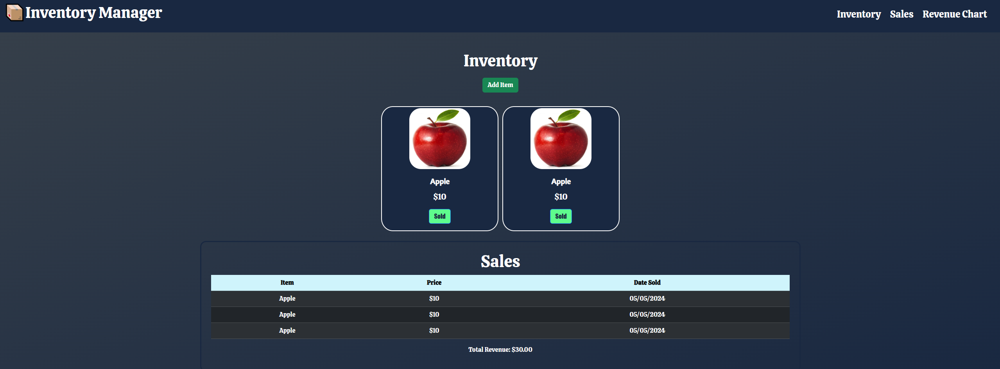

# Inventory Manager

    Inventory Manager is an app made for small businesses to keep track of their inventory while also keeping track of the revenue made by those items.

## How To Use

    Inventory Manager is easy to use. By clicking on the add item button in the Inventory section, you can add any item along with an image and price you are selling the item for. After completing the modal, your item will be added to your inventory with a sold button. After marking the item as sold, the item along with its price and date it was sold will be moved to the sales table. There you can see all the items you've sold and at the bottom of the section, how much total revenue you've made from the items on the table.

## Technologies Used

    Inventory Manager was made using Javascript, CSS, and HTML. All with their respective folders in the assets folder in the repository. Inventory Manager also made use of a Bootstrap Framwork table for the Sales table

## Screenshot of UI

    Example:

    

## Link to App

    Our app can be located here: https://carterpaccione.github.io/Project-1/